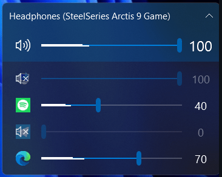

## [EarTrumpet](https://github.com/File-New-Project/EarTrumpet)

### Ohjelma
- **Nimi:** EarTrumpet
- **Kuvaus:** Äänentoiston hallintaohjelma Windowsille. Parantaa oletusäänenvoimakkuusliukusäädintä lisäämällä samaan näkymään eri ohjelmien äänenvoimakkuuksien mikserin ja helpon tavan vaihtaa äänentoistolaitetta.

- **Toimintaperiaate:** EarTrumpetin käyttöliittymä on luotu [Windows Presentation Foundation](https://learn.microsoft.com/en-us/dotnet/desktop/wpf/overview/?view=netdesktop-7.0) -kirjastoa (WPF) käyttäen. Ohjelma näkyy Windowsin tehtäväpalkin oikeassa reunassa olevana äänenvoimakkuussymbolina (identtinen Windowsin oman kanssa), josta voi avata mm. äänimikserin ja ohjelman asetukset. EarTrumpet korvaa Windowsin oman äänentoistohallinnan käyttäen [Windows Multimedia Device API](https://learn.microsoft.com/en-us/windows/win32/api/_multimedia/):tä, mahdollistaen esimerkiksi yksittäisten ohjelmien äänilaitteiden vaihdon.[^toiminta]
- **Käyttökohteet:** Ohjelma on yleishyödyllinen, sillä lähes kaikkien tietokoneen käyttäjien täytyy muuttaa äänenvoimakkuutta joskus. Ohjelmasta voi olla erityisen paljon hyötyä sellaisessa toiminnassa, jossa äänilähdettä täytyy vaihtaa usein, tai käytettäessä kuulokkeita, joissa on korkea herkkyys (jolloin pää-äänenvoimakkuus pitää laittaa alhaiseksi ja hienosäätöä tehdä yksittäisten sovellusten säädöillä).

### Lisenssi
- **Lisenssi:** [Ohjelmisto on lisensoitu MIT-lisenssin alaisena.](https://github.com/File-New-Project/EarTrumpet/blob/master/LICENSE) MIT lisenssi on lyhyt ja yksinkertainen salliva lisenssi, jonka ehdoissa vaaditaan ainoastaan tekijänoikeus- ja lisenssi-ilmoitusten säilyttämistä. Lisensoituja teoksia, muutoksia ja laajempia teoksia voidaan jakaa eri ehdoilla ja ilman lähdekoodia.[^lisenssi]

### Projektin Aktiivisuus ja Ylläpito
- **Historia:** EarTrumpetin GitHub-repositorio luotiin heinäkuussa 2017. 29.9.2023 mennessä ohjelmalla on ollut 40 eri versiota, ja vuonna 2018 se siirtyi versiosta 1.x versioon 2.x.[^changelog] Tässä päivityksessä oli paljon uusia ominaisuuksia, ja projektin kehitys oli erityisen aktiivista.[^contributors]
- **Aktiivisuus:** Projektin aktiivisuus on vähentynyt vuoden 2019 jälkeen, mutta projektin dev-haaraan tehdään uusia muutoksia silloin tällöin[^dev], ja käyttäjien ongelmiin vastataan aktiivisesti. Ohjelmasta julkaistaan uusia versioita muutama vuodessa. Lisäksi vapaaehtoiset käyttäjät kääntävät ohjelman käyttöliittymää aktiivisesti eri kielille.[^kielet]
- **Ylläpito:** Projektin takana on kolmen hengen ryhmä [File-New-Project](https://github.com/File-New-Project), joka on tehnyt suurimman osan ohjelman kehityksestä ja ylläpidosta. Sen lisäksi koodia on kirjoittanut projektiin 24 muuta vapaaehtoista 29.9.2023 mennessä.[^contributors]

### Osallistuminen Projektiin
- **Contribution Model:** Projektissa ei taida olla varsinaisia rooleja tai vastuualueita osallistujille, vaan kaikki menettelevät saman kaavan mukaan. Projektiin voi osallistua issueilla tai pull requesteilla. Issuella osallistumiseen tulee bugien reportoinnin tapauksessa täyttää issue template. Mikäli asia koskee uusia ominaisuuksia tai kysymyksiä, siirtyy keskustelu projektin keskustelualueelle.[^issues]  Pull requesteihin on toivottu menettelytapa. [^contributing]
- **Osallistumisen Menettelytavat:**

  Bugia reportoidessa pakollisia tietoja: 
  - Summary
  - Steps to reproduce
  - EarTrumpet version
  Valinnaisena:
  - Additional information

  Pull requesteilla osallistumisen toivotaan tapahtuvan seuraavan kaavan mukaan: 
  - Ensimmäiseksi, tulee etsiä tai tehdä uusi korjattava issue. 
  - Seuraava vaihe on ottaa yhteyttä projektin ylläpitotiimiin ja pyytää lupaa muutoksiin. 
  - Hyväksynnän jälkeen, tulee repositorio forkata ja tehdä siihen uusi branch "dev"-brachista, joka on nimetty tehtävien muutosten mukaan. 
  - Muutoksien jälkeen tulee tarkistaa muutoksien toimivuus buildaamalla projekti ja sen jälkeen puskea toimivat muutokset omaan forkkiin. 
  - Viimeinen vaihe on tehdä pull request juuriprojektin "dev"-branchiin.

### Tekninen Toteutus
- **Kielet:**
  - C Sharp (C#)
- **Protokollat:**
	- Windows Multimedia Device API: Tämä on Windowsissa käytettävä ohjelmointirajapinta (API) monimediaan liittyvien tehtävien suorittamiseen, kuten äänen ja videon käsittelyyn.

- **Välineet**:
  - Windows Presentation Foundation (WPF): Tämä on Microsoftin kehittämä graafisen käyttöliittymän kehys (framework), jota käytetään sovellusten käyttöliittymien suunnitteluun ja toteuttamiseen.
  - Windows Storage tai rekisteri (Registry): Tämä viittaa välineisiin Windows-käyttöjärjestelmässä, joiden avulla voi tallentaa sovelluksen tietoja tai asetuksia. Windows Storage käsittää esimerkiksi Windows.Storage.ApplicationData, kun taas rekisteri (Registry) on osa Windowsin rekisteriä, johon asetuksia voidaan tallentaa.
  - Bugsnag: Tämä on virheraportointityökalu, joka auttaa sovelluskehittäjiä keräämään ja analysoimaan sovellusten virheraportteja.
  - CircularBufferTraceListener: Tämä on diagnostiikkaväline, jota käytetään jäljitystietojen tallentamiseen ja seurantaan sovelluksissa.
  - Platform Invoke (P/Invoke) ja kääreet (wrappers): Platform Invoke (P/Invoke) on väline, joka mahdollistaa kutsujen suorittamisen Windowsin alhaisen tason rajapintoihin. Kääreet (wrappers) ovat ohjelmistokomponentteja, jotka voivat helpottaa P/Invoke-kutsujen käyttöä ja integrointia.
  - Tyyppikirjasto (Type Library, TLB): Tämä on väline, joka sisältää tiedot COM-liittymistä ja komponenteista, jotka voivat olla käytettävissä sovelluksissa.
  - COM-liittymät (COM interfaces): Nämä ovat osa COM-komponenttien käyttöä ja niitä voidaan käyttää ohjelmointirajapintoina sovelluksen ja COM-komponentin välillä.
  - XAML: Tämä on käyttöliittymän määrittelykieli, jota käytetään Windows Presentation Foundation (WPF) -sovellusten käyttöliittymän suunnitteluun ja teemoittamiseen.

### Projekti Käyntiin
- **Asennus ja Käyttöönotto:**
  - [*Microsoft Store*](https://www.microsoft.com/store/apps/9nblggh516xp)
  - [*Windows Package Manager Client*](https://github.com/microsoft/winget-cli) komennolla: `winget install File-New-Project.EarTrumpet`
  - *Chocolatey* komennolla: `choco install eartrumpet`

[^toiminta]: [EarTrumpet Technical Documentation](https://github.com/File-New-Project/EarTrumpet/blob/master/EarTrumpet/README.md)
[^lisenssi]: [choosealicense.com/licenses/mit](https://choosealicense.com/licenses/mit/)
[^changelog]: [CHANGELOG.md](https://github.com/File-New-Project/EarTrumpet/blame/master/CHANGELOG.md)
[^dev]: [Commits - dev-haara](https://github.com/File-New-Project/EarTrumpet/commits/dev)
[^kielet]: [EarTrumpet @ Crowdin](https://crowdin.com/project/eartrumpet)
[^contributors]: [EarTrumpet contributors](https://github.com/File-New-Project/EarTrumpet/graphs/contributors)
[^issues]: [/issues/new/choose](https://github.com/File-New-Project/EarTrumpet/issues/new/choose)
[^contributing]: [CONTRIBUTING.md](https://github.com/File-New-Project/EarTrumpet/blob/master/CONTRIBUTING.md)
