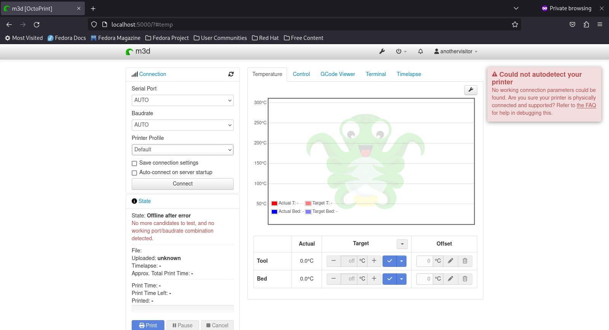

## OctoPrint

[Octoprint](https://github.com/OctoPrint/OctoPrint)
### Kuvaus

OctoPrint on nopea verkkokäyttöliittymä 3D-tulostimelle. Se tarjoaa täyden etäohjauksen ja seurannan
mahdollisuuden, jotta voit hallita ja valvoa 3D-tulostinta ja tulostustehtäviä suoraan selaimellasi. Lisäksi OctoPrint
on yhteensopiva ja laajennettavissa liitännäisjärjestelmällä (plugin).


### Toimintaperiaate

OctoPrint asennetaan käyttäen Pythonin pip-pakettienhallintaa. Asennuksen jälkeen sen voi käynnistää
komentoriviltä octoprint-skriptillä. Palvelimen ollessa käynnissä, käyttäjä voi hallita ja valvoa 3D-tulostimen
toimintaa selaimen avulla. Tulostustehtäviä voi käynnistää, pysäyttää ja valvoa etänä. Käyttäjä voi joustavasti ottaa
käyttöön laajennuksia ja mukauttaa asetuksia oman tarpeensa mukaan.

### Missä OctoPrintiä käytetään

3D-tulostimen etähallinnan sovellukset tekevät 3D-tulostuksesta helpompaa, joustavampaa ja tehokkaampaa. Ne ovat 
erityisen hyödyllisiä harrastajille,
ammattilaisille ja koulutusympäristöissä.

### Lisenssi 

Octoprintilla on AGPL-3 lisenssi, joka pohjautuu perinteiseen GPL lisenssiin. Se on kuitenkin suunniteltu nimenomaan 
verkkosovelluksille. 

Lisenssi sallii siis ohjelmiston vapaan käytön, muokkauksen ja jakelun kaikissa projekteissa (myös kaupallisissa), 
Koodi ja kaikki muutokset pitää levittää samalla lisenssillä. 


### Projektin historia ja aktiivisuus

Projekti on perustettu vuonna 2011 ja sillä on tällä hetkellä 1,7 tuhatta erillistä forkkia ja noin 230 eri kehittäjää.  
Projektin päävastuussa on käyttäjä @foosel, joka työskentelee kokopäiväisesti projektin parissa. @foosel on tehnyt 
projektiin tähän mennessä 5 300 committia. 

Isompia päivityksiä projektiin on viimeaikoina tehty noin kerran kuukaudessa.

### Projektiin osallistuminen

Projektiin voi osallistua kuka vain asiasta kiinnostunut. Osallistua voi monella tavalla, ominaisuuksia kehittämällä, 
bugeja etsimällä tai vain osallistumalla keskusteluun projektin keskustelufoorumilla tai Discordissa.

Prokjektilla on tarkat ohjeet pull requesteille ja bugien raportoimiselle. Pull requestia tehdessä, tulee seurata
12 kohdan ohjetta ja toimia sen mukaan. Projektin GitHub sivustolla on bugien raportoinnille tarkoitettu lomake,
joka täytetään ja lähetetään. Mikäli on epävarma kuinka toimia, voi asiasta keskustella projektin keskustelufoorumilla.  
 
### Tekninen toteutus

Käytetyimmät kielet ovat Python, JavaScript ja G-code. OctoPrintia voi halutessaan ajaa Rasperry Pi:llä.


### Projekti käyntiin

Lähtökohtaisesti OctoPrint on suunniteltu asennettavaksi pienitehoisiin sulautettuihin järjestelmiin, kuten Raspberry Pi. Raspberry Pille suositellaan [OctoPi](https://github.com/guysoft/OctoPi) -levykuvaa, jossa on mukana Raspbian-käyttöjärjestelmä, OctoPrint ja mjpg-streamer.

Muita asennus- ja käyttömahdollisuuksia:

- [Octo4a](https://github.com/feelfreelinux/octo4a) - Android-sovellus
- [OctoPrint for Orange Pi](https://www.obico.io/docs/user-guides/orange-pi-for-octoprint-download-setup/)
- [Docker](https://github.com/OctoPrint/octoprint-docker)
- [octoprint_deploy](https://github.com/paukstelis/octoprint_deploy) - Ohjattu skripti mille tahansa Linuxille
- [OctoPrint-WindowsInstaller](https://github.com/jneilliii/OctoPrint-WindowsInstaller) - Asennusohjelma Windowsille

#### Yleisohje asentamiseen

1. Asenna Python 3 (versio 3.10 tai aiempi) ja pip.
2. Luo virtuaaliympäristö:
`python -m venv OctoPrint`
3. Asenna OctoPrint kyseiseen virtuaaliympäristöön:
`OctoPrint/bin/pip install OctoPrint`
4. Käynnistä OctoPrint:
`./OctoPrint/bin/octoprint serve` tai `/polku/OctoPrint/bin/octoprint serve`

#### Yksityiskohtaisemmat ohjeet

- [Raspbian](https://community.octoprint.org/t/setting-up-octoprint-on-a-raspberry-pi-running-raspbian/2337/)
- [RHEL](https://community.octoprint.org/t/setting-up-octoprint-on-a-computer-running-fedora-centos-almalinux-or-rockylinux/37137)
- [Windows](https://community.octoprint.org/t/setting-up-octoprint-on-windows/383/1)
- [Mac](https://community.octoprint.org/t/setting-up-octoprint-on-macos/13425)

#### Lähdekoodista kääntäminen

OctoPrintin [dokumenteissa](https://docs.octoprint.org/en/maintenance/development/environment.html) on ohjeet kehitysympäristön kuntoon laittamiseksi.

Esimerkiksi Linuxilla:

1. Varmistetaan, että mm. python 3, pip ja virtualenv on asennettu: `sudo apt-get install python3 python3-pip python3-dev python3-setuptools python3-virtualenv git libyaml-dev build-essential`
2. Sitten: 
```
cd ~/devel
git clone https://github.com/OctoPrint/OctoPrint.git
cd OctoPrint
virtualenv --python=python3 venv
source ./venv/bin/activate
pip install --upgrade pip
pip install -e '.[develop,plugins,docs]'
pre-commit install
git config blame.ignoreRevsFile .git-blame-ignore-revs
```

#### Käyttöönotto

Linuxilla, jos ei lähde käyntiin jo koneen käynnistyessä:
`./bin/octoprint serve`

Web-selaimen osoiteriville:
`localhost:5000`


