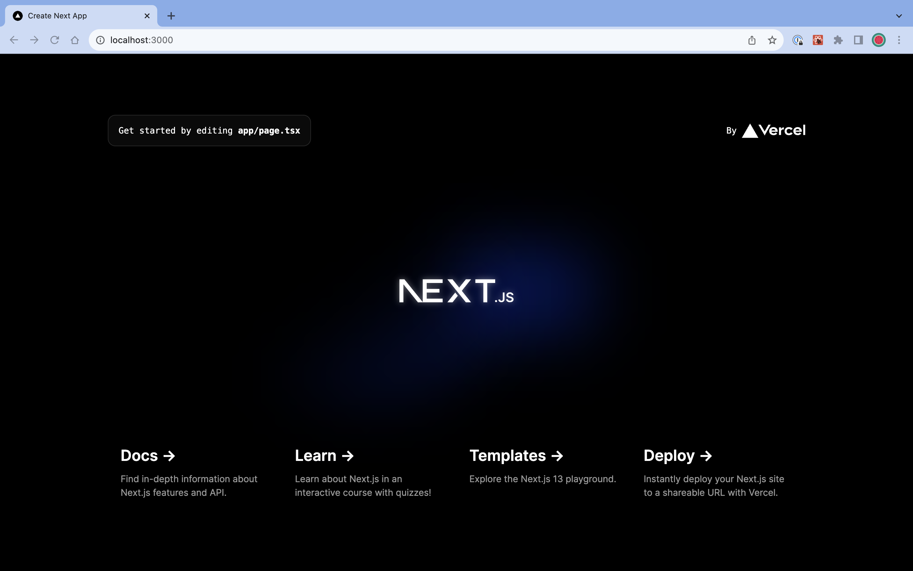

## next.js

### Ohjelma
- **Nimi:** next.js
- **Kuvaus:** Next.js on React-pohjainen web-ohjelmointiin tarkoitettu ohjelmistokehys.
- **Toimintaperiaate:** Next.js avulla voit luoda nettisivuprojektin nopeasti hyödyntämällä kehyksen tarjoamia kehitysominaisuuksia.
- **Käyttökohteet:** Next.js on hyvä työkalu nopeasti latautuvien hakukoneoptimoitujen sivujen tekoon, koska se renderöi nettisivut suoraan palvelimella asiakaspuolen sijaan. Tällöin hakurobotti saa heti valmiiksi renderöidyn html-koodin, joka on helppo indeksoida eikä html-koodin generoimiseen tarvitse käyttää aikaa. Next.js:ää on käytetty esimerkiksi Netflixin käyttöliittymässä. [^next]

### Lisenssi
- **Lisenssi:** MIT-lisenssi. Antaa käyttäjälle oikeudet vapaasti muokata, kopioida ja käyttää teosta omassa projektissa sillä ehdolla, että lisenssin teksti säilyy lähdekoodissa.[^lisenssi]

### Projektin Aktiivisuus ja Ylläpito
- **Historia:** Projekti julkaistiin ensimmäisen kerran vuonna 2016. Tämän jälkeen sitä on kehitetty aktiivisesti. Viimeisin versio Next.js 13.5.4 julkaistiin lokakuussa 2023.
- **Aktiivisuus:** Projektiin tehdään päivittäin pieniä päivityksiä/korjauksia, esim. viikon 8.10.-15.10.2023 aikana tehtiin 97 pull requestia ja näistä 66 mergeä. Isommissa versiopäivityksissä voi olla väliä jopa vuosi.
- **Ylläpito:** Projektia ylläpitää yritys nimeltä Vercel.

### Osallistuminen Projektiin
- **Contribution Model:** Projektiin voi osallistua vapaasti kuka vaan. Ennen osallistumista on kuitenkin hyvä perehtyä projektin kehittäjien laatimiin ohjeisiin, kuinka he toivovat projektiin osallistuttavan. Next.js:llä on ylläpitotiimi, joka käy läpi pull requestit ja mergeää forkit tai antaa tekijälle palautetta puutteista.[^osallistuminen]
- **Osallistumisen Menettelytavat:** Projektin kehittämiseen voi osallistua monella tapaa. Yksinkertaisin tapa osallistua lienee projektin keskustelualueelle kirjoittaminen. Siellä voi esittää näkemyksiään, miten projektia kannattaisi kehittää. Toinen helppo tapa osallistua on kertoa ongelmasta [Issues](https://github.com/vercel/next.js/issues). Tällöin muut kehittäjät näkevät löytämäsi ongelman ja voivat korjata sen. Halutessasi voit myös itse tehdä korjauksia joko itse löytämiisi tai toisten löytämiin ongelmiin. Voit osallistua esim. dokumentaation, testien tai esimerkkien tekemiseen ja korjaamiseen.

### Tekninen Toteutus
- **Kielet:** JavaScript, TypeScript, Rust[^github]
- **Protokollat:** HTTP, HTTPS, The Open Graph protocol, SSR
- **Välineet:** React, Turbopack, SWC, Node.js

### Projekti Käyntiin
- **Asennus ja Käyttöönotto:** Aluksi projekti kannattaa forkata itselleen, jonka jälkeen sen saa koneelleen käyntiin seuraamalla projektin ohessa annettuja ohjeita.
- [Käynnistysohjeet](https://github.com/vercel/next.js/blob/canary/contributing/core/developing.md)
- **Nextin käyttäminen itse:** Next.js:n käyttö edellyttää, että [Node.js](https://nodejs.org/en) on asennettu. Next.js:n käyttöönotto tapahtuu suorittamalla terminaalissa komento:  
*`npx create-next-app@latest`*  
Komento luo projektille kansion sekä asentaa tarvittavat riippuvuudet.

[^lisenssi]: [https://fi.wikipedia.org/wiki/MIT-lisenssi](https://fi.wikipedia.org/wiki/MIT-lisenssi)
[^osallistuminen]: [How to Contribute to Open Source](https://www.youtube.com/watch?v=cuoNzXFLitc&ab_channel=LeeRobinson)
[^next]: [https://nextjs.org/](https://nextjs.org/)
[^github]: [https://github.com/vercel/next.js](https://github.com/vercel/next.js)

*Generated using GPT-3.5*
